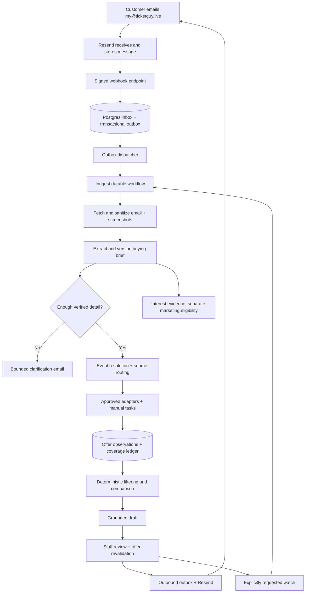

# Ticket Guy — MVP engineering specification

Version 1.0 · Research date: September 22, 2026 · Status: implementation-ready design; external access and launch gates remain.

Domain: **ticketguy.live**. Public service address: **my@ticketguy.live**. These are intended addresses, not a claim that the domain is purchased or configured.

This package is designed for handoff to Claude Code or another coding agent. It does not depend on the coding agent's model name. No production application, accounts, DNS changes, integrations, or campaigns have been created by preparing this specification.

## 1. Product contract

Ticket Guy is an independent, email-first concierge for US live-event ticket buyers. A customer emails a ticket link, screenshot, or description. The service understands the request, checks suitable sources, compares genuinely appropriate offers, and returns a concise recommendation with seller links. Customers purchase with the seller.

The promise is: **Email your ticket guy. Send what you're considering—or what you want to see—and we'll check your options.**

Primary jobs:

- **Beat my offer:** compare an existing offer against suitable alternatives.
- **Find my options:** turn a description into a verified event and buying brief.
- **Keep looking:** monitor an agreed target and deadline; notify when a suitable offer appears.
- **Remember my interests:** derive evidence-backed preferences for useful future service and separately permitted marketing.

Launch boundary: US customers, events in the 50 states and Washington, DC, USD comparisons. Initial pilot defaults to concerts and NHL/NBA/MLB games at supported NYC-area venues. This pilot scope is a proposed engineering default, configurable by operations; it is not a previously validated commercial niche. US venue location is not proof the customer is US-based. Ask for a simple country confirmation in the first clarification or preference step; do not infer residence from an email domain or event.

Accept other US requests into manual review, state limitations, and do not imply nationwide automation. Maintain the full 135-entry registry and category routing policy as a research reference, not 135 working adapters.

### Explicit exclusions

No ticket purchasing, reservations, payments, ticket custody, seller logins, ticket transfers, automated lottery entry, native mobile app, SMS, URL-prepending product, consumer account system, open-ended autonomous browser, probabilistic price forecasts, scraping behind access controls, mass automated marketing, CRM purchase, vector database, fine-tuning, or resale marketplace.

The site supports the email service; it is not the main shopping interface. No full public event catalog or fabricated demo listings in production.

### Operating model

A human approves every market recommendation, monitoring alert, and promotional campaign in the pilot. Receipt acknowledgments, unsubscribe processing, and tightly bounded clarification templates may be automatic. The AI prepares work; application rules control side effects.

Customers are told the service is AI-assisted and human-reviewed. Do not impersonate a person claiming to have personally attended venues or performed checks that did not occur.

## 2. Recommended stack and alternatives

| Component | Decision | Rationale / boundary |
|---|---|---|
| AI | OpenAI Responses API, official TypeScript SDK | Structured extraction, screenshot interpretation, bounded discovery and grounded drafting |
| Default model | `gpt-5.4-mini`, snapshot `gpt-5.4-mini-2026-03-17` after account verification | Documented image input, structured output and web-search support; practical starting point, not a claim it beats all models |
| Escalation model | `gpt-5.4`, configured separately and pinned after evaluation | Ambiguous event matching or difficult draft review; no automatic indefinite escalation |
| Email | **Resend**, inbound + outbound; React Email templates | Verified-domain receiving, attachment retrieval, thread headers, signed webhooks and idempotent sends |
| App | Next.js App Router, TypeScript strict mode, supported Node LTS, pnpm | One repository for public pages, private operations UI and API endpoints |
| Styling | Tailwind + accessible shadcn/ui primitives | Small responsive admin product; plain readable email-first public site |
| Hosting | Paid Render Node web service, colocated with database | Deploy Next.js and bounded Inngest handlers; keep durable workflow state outside process memory |
| Database | Dedicated Render PostgreSQL 18 database; postgres.js through `drizzle-orm/postgres-js` | Same database pattern as founder’s other projects; separate Ticket Guy credentials/data |
| Local development/tests | `@electric-sql/pglite` through `drizzle-orm/pglite` | Shared `pg-core` schema and SQL migrations; real Postgres CI for concurrency and production parity |
| Staff identity | Better Auth with Drizzle adapter, TOTP MFA and explicit staff roles | Server-owned sessions; invite-only staff; customers need no account |
| Files | Database-backed private `media_objects` through a storage interface | Bounded pilot attachments in Postgres; authorized download route; later S3-compatible adapter |
| Jobs | Inngest | Durable steps, retries, schedules, concurrency and cancellation |
| ORM/schema | Drizzle + reviewed SQL migrations; Zod runtime validation | Explicit transactional invariants; version dependencies in lockfile |
| Error reporting | Sentry with PII scrubbing | Operational errors and trace IDs; no email bodies or sensitive attachments |
| Product measurement | First-party Postgres events | No additional customer analytics platform required at launch |
| CI | GitHub Actions | Type checking, unit/integration tests, build, security checks, fixture E2E |
| Ticket data | Ticketmaster Discovery + manual source checks; one licensed resale adapter once approved | Discovery is not listing-level comparison; production access is a separate milestone |

Verify current compatible library versions when scaffolding; pin exact installed versions and commit the lockfile. Do not invent future package versions or change the architecture because a generator prefers another stack.

The OpenAI model pages establish the selected capabilities; validate the actual account's access with a bounded smoke test. [Mini](https://developers.openai.com/api/docs/models/gpt-5.4-mini), [escalation](https://developers.openai.com/api/docs/models/gpt-5.4), [structured outputs](https://developers.openai.com/api/docs/guides/structured-outputs).

### Email provider decision

| Provider | Fit | Decision |
|---|---|---|
| Resend | Inbound retrieval, attachments, threaded replies, send idempotency; good fit for this TypeScript app | Implement now; obtain written confirmation before affiliate-funded promotional launch |
| Mailgun | Flexible inbound routing and store/retrieve workflow; strong alternative for a more complex email pipeline | Do not implement initially; its AUP explicitly requires marketing consent and flags affiliate marketing for scrutiny |
| Postmark | Inbound webhook and transactional/broadcast streams | Credible alternative; its terms also flag affiliate-marketing use |
| Amazon SES | Usage-based email infrastructure with regional inbound processing | Revisit at scale if economics justify extra receipt-rule, storage, suppression and operations work |

Evidence: [Resend inbound](https://resend.com/docs/dashboard/receiving/introduction), [Resend AUP](https://resend.com/legal/acceptable-use), [Mailgun receiving](https://documentation.mailgun.com/docs/mailgun/user-manual/receive-forward-store/storing-and-retrieving-messages), [Mailgun AUP](https://www.mailgun.com/legal/aup/), [Postmark inbound](https://postmarkapp.com/developer/webhooks/inbound-webhook), [Postmark terms](https://postmarkapp.com/terms-of-service), [SES receiving](https://docs.aws.amazon.com/ses/latest/dg/receiving-email-concepts.html).

This is a product-fit recommendation, not a provider deliverability benchmark. Resend's published AUP does not separately name affiliate marketing as a prohibited category, but that is not approval of Ticket Guy's business model. Obtain provider confirmation for customer-requested recommendations containing affiliate links and, separately, opt-in promotional ticket offers. Standard non-affiliate service replies can be tested first.

### Database and deployment pattern (updated from founder’s screenshot)

Use the familiar PostgreSQL-everywhere pattern. The screenshot describes another project; its database name and Frankfurt region are context, not credentials or an instruction to share its database. Provision a dedicated Ticket Guy database when deployment is authorized. Default new app/database placement to the same US Render region for the US pilot; make region configurable. US market scope is separate from a data residency guarantee.

- Define tables once in `src/lib/db/schema.ts` using `drizzle-orm/pg-core`; keep reviewed SQL migrations in `/drizzle` and driver selection in `src/lib/db/index.ts`.
- With `DATABASE_URL` set, use `postgres` (postgres.js) via `drizzle-orm/postgres-js`. If absent in development/tests only, use PGlite via `drizzle-orm/pglite`. Production/staging must fail startup on a missing or invalid URL; never silently create an embedded production database.
- Persist local PGlite data in an ignored `.local/pglite` directory; tests use isolated disposable databases. Auto-apply committed migrations locally before serving. Apply production migrations once in a controlled deployment step with migration locking; never from every request or web replica. No production `drizzle-kit push`.
- Start `PG_POOL_MAX=5` per app process, then budget all web instances, workflow handlers, migration connections and operations against the selected database limit. Reuse one pool per process. Configure network/TLS according to Render’s connection documentation; never disable certificate verification to work around errors.
- Use one migration set compatible with both drivers. PGlite is single-connection and does not prove multi-session locking, outbox claims or production version/extension compatibility. Run database integration and concurrency tests on real PostgreSQL 18 in CI/staging in addition to fast PGlite tests. [Drizzle PGlite setup](https://orm.drizzle.team/docs/get-started/pglite-new), [PGlite connection constraint](https://pglite.dev/docs/pglite-socket).
- Store bounded pilot media bytes in `media_objects`: opaque ID, request/message ownership reference, MIME type, byte length, SHA-256, binary bytes, creation and expiry timestamps. Use portable PostgreSQL `bytea` via a reviewed Drizzle type; no base64 in general business rows. Keep list queries free of binary columns. Enforce the existing per-message limits plus a configurable total-media budget (initially 1 GiB); alert at 80%, stop new blob ingestion at the cap and surface a recoverable staff task. Never silently discard a message’s missing attachment.
- `MEDIA_PROVIDER=db` is the pilot default in both environments. Expose `put/get/delete` behind a storage interface and serve downloads only through a staff-authorized, no-store application endpoint. Do not persist attachments on Render’s ephemeral application filesystem. An S3/R2 adapter is a later implementation, not an existing capability; selecting it before installation must fail configuration validation.
- Deploy Next.js as a Node service on Render, with health checks and graceful pool shutdown. Keep Inngest for durable steps; configure its supported scheduled recovery workflow against Render-hosted handlers. Include `render.yaml` with no embedded secrets, a paid web service, dedicated database and a single controlled migration step. Build/test jobs must not accidentally connect to production.

## 3. Email identity, DNS and delivery

### Addresses

- Public inbound and service From: `Ticket Guy <my@ticketguy.live>`.
- Service Reply-To: `my@ticketguy.live`. Preserve threads with MIME headers; do not require users to remember unique addresses.
- Optional correlation alias: `my+<opaque-thread-token>@ticketguy.live` only after provider catch-all behavior is tested. It is a routing hint, not authorization.
- Marketing From: `Ticket Guy Deals <deals@news.ticketguy.live>`; Reply-To remains `my@ticketguy.live`.
- Staff notifications: configured real staff address, never invented.
- Technical/legal aliases such as `postmaster`, `abuse`, `privacy`, `support`: explicitly routed to staff, never to the AI sales flow. DMARC reports use a dedicated reporting destination.

Separate sending domains/configuration help classify streams, but do not guarantee complete reputation isolation. Do not disguise promotions as replies by adding `Re:` or reusing a service thread. No BCC campaigns.

### Setup runbook

1. Confirm ownership of ticketguy.live and inspect existing MX records before changing anything. Domain availability is not registration.
2. Add and verify the sending and receiving domains in Resend. Use exact provider-supplied DNS records; do not hard-code guessed DKIM keys or MX targets.
3. Root receiving MX must deliver `my@ticketguy.live` to Resend. If root already handles a real mailbox, design explicit forwarding/coexistence first; replacing MX can disrupt it.
4. Configure SPF, DKIM and aligned DMARC; initially monitor and confirm all legitimate senders before tightening policy. Keep DNS credentials out of the app.
5. Configure production and staging webhooks with separate secrets and domains. Subscribe only to required received/sent/delivered/failed/bounced/complained events and applicable subscription events.
6. Verify authenticating service replies and promotions separately in Gmail, Outlook and Apple Mail. Test screenshots, forwards, plain text, HTML-only and repeat replies.
7. Enable Google Postmaster Tools when volume supports useful reporting. Do not promise a dedicated IP improves a low-volume pilot.

Resend receiving delivers notification metadata; retrieve full content and attachment details separately. Use `html_format=cid` to avoid enormous inline-image HTML. Copy necessary attachments promptly into private storage, rather than relying on expiring download URLs or provider retention. [Receiving](https://resend.com/docs/dashboard/receiving/introduction), [retrieval](https://resend.com/docs/api-reference/emails/retrieve-received-email).

### Recipient and threading rules

Resolve recipients from provider envelope/received recipient metadata and an explicit allowlist. Unknown aliases receive no automatic response. Never reply-all by default. The customer is the authenticated top-level sender, not someone quoted in a forwarded message.

Persist provider email ID and RFC Message-ID separately. Correlate inbound replies by `In-Reply-To` and `References` against stored messages, then require the same authorized participant. Subject similarity is only a hint. A new event mentioned in an old thread creates a new request within the conversation after confirmation; multiple active requests require disambiguation.

A signed provider webhook authenticates the provider, not the human sender. Use provider-computed SPF/DKIM/DMARC results where available; quarantine suspicious sender mismatches. A new sender referencing another user's Message-ID must not receive that user's history. Destructive privacy actions and access to full history require a separate emailed verification flow; normal new shopping requests can proceed without customer accounts.

On reply, send `In-Reply-To` referencing the inbound RFC Message-ID and a bounded `References` chain. Persist the provider-assigned outbound Message-ID from retrieval/webhooks. Never substitute a database UUID for an RFC Message-ID. [Provider threading](https://resend.com/changelog/message-id-for-sent-emails).

### Auto-reply and abuse controls

Detect delivery-status notifications, list/bulk mail, `Auto-Submitted`, out-of-office replies and the service's own addresses before invoking AI. Do not autorespond to these. Respect sender suppression and authentication risk. Proposed pilot limits: 10 new requests/day per sender, 3 concurrently active requests, 3 automatic clarification exchanges before review, and a configurable global AI/email ceiling. Legitimate follow-ups are not automatically new requests. Rate-limit abuse without teaching attackers which private addresses exist.

## 4. System architecture and durable workflow

Inngest handles orchestration; Postgres remains the authoritative business state. Never rely on process memory, an HTTP request staying open, or a model conversation as the database.

### Intake and outbox guarantees

- Verify raw webhook signature using the current Resend SDK and header contract before accepting data. Persist verified metadata and a dispatch outbox row in one transaction. Return 2xx only after durable commit; duplicate valid events return 2xx without creating work. Database unavailable means a retryable error.
- Deduplicate provider webhooks using provider event ID; deduplicate received messages using provider email ID. RFC Message-ID is an additional signal, not globally reliable uniqueness across all senders.
- Immediately try dispatching committed work to Inngest. A signed scheduled recovery dispatcher scans outstanding outbox rows at least every minute so a crash between commit and publish cannot lose the message.
- Use row leases/`FOR UPDATE SKIP LOCKED`, attempt counts and backoff. Inngest events contain IDs and revisions only, not full emails or images. Small durable steps retrieve data by ID.
- Process mutations for each conversation serially, using a revision check or lock. A late AI result from revision 3 cannot overwrite revision 4.
- Write each outgoing email to an immutable send intent with a deterministic key. Use the same Resend idempotency key and byte-equivalent payload for all retries of that intent. Keep permanent local send records: Resend's key retention is 24 hours. After an ambiguous send older than that window, reconcile provider state or require staff review; do not blindly resend. [Idempotency](https://resend.com/docs/dashboard/emails/idempotency-keys).
- Record `queued`, `submitted`, `delivered`, `bounced`, `failed`, `complained`, `unknown`; a successful API call is not delivered mail. Out-of-order provider events must not erase a bounce or complaint.

### Request states

`received → interpreting → needs_clarification | resolving_event → researching → awaiting_review → recommendation_sent → monitoring | closed`

Other explicit states: `manual_attention`, `unsupported`, `expired`, `cancelled`, `failed`. A replied-to closed request may reopen under a new revision. Event cancellation/rescheduling pauses research/watches and requires confirmation of the new objective.

Each state transition has an actor, reason, revision, timestamp and audit entry. Editing the brief or recommendation invalidates existing approval. A recommendation is approved for a specific request revision, draft hash and set of observation IDs.

## 5. OpenAI implementation

### Stage design

1. **Classify and extract:** email intent, new/updated requirements, URLs, screenshot fields, unresolved ambiguity. Return a strict structured object; preserve evidence references.
2. **Resolve event candidates:** query event sources and limited official-web discovery using only event facts. Ask the user when multiple plausible events remain. Do not guess that an example event exists.
3. **Explain verified comparisons:** draft a short email from database-backed offer IDs, computed totals and coverage. Return recommended IDs and explanation fields, not invented listings or arbitrary purchase URLs.
4. **Suggest interests:** propose taxonomy-backed interest observations with source message, confidence and negation. No direct marketing subscription mutation.

Use `responses.parse` or the current SDK equivalent with strict JSON Schema/Zod output. Handle refusal, malformed output, incomplete responses, rate limits and timeouts explicitly. Schema correctness does not establish factual correctness. Use separate discovery and extraction/drafting calls where a tool combination is unsupported; test rather than assume.

Configuration:

- Default: mini snapshot, low reasoning where supported; extraction output cap around 2,000 tokens, drafting around 1,200. These are proposed application limits.
- Escalation: one larger-model attempt for unresolved extraction/matching; then manual review.
- Web discovery: at most 3 search calls per new request by default, bounded to relevant official domains where known. Increase only through staff action or a scoped configuration change.
- Maximum 8 model calls per request revision, estimated $0.50 soft AI/search budget and $1.00 automatic hard stop to manual review. Maintain a global daily cap too. Reserve estimated spend before concurrent calls; billable retries count.
- Use `store:false`; keep application memory in Postgres and do not create persistent provider conversation/file stores unnecessarily. This does not mean zero provider retention. Apply actual account controls and document exceptions. [OpenAI data controls](https://developers.openai.com/api/docs/guides/your-data).

### Allowed model actions

Read sanitized brief, propose clarification, propose event candidate IDs, request bounded discovery, read approved source/offer data, and propose a draft. No direct send-email, unsubscribe reversal, SQL execution, shell, payment, account login, unrestricted browser, marketing launch, or arbitrary URL-fetch tool.

Treat email text, quoted emails, screenshots, web pages and API description fields as untrusted data. They cannot change system instructions, tools, budget, recipient or permissions. Secrets and customer history are never placed in search queries. Avoid sending customer names or email addresses to the model when not necessary.

### Screenshot processing

Accept JPEG, PNG and WebP initially, including inline email attachments. Proposed limit: 3 relevant screenshots, 10 MB each, 20 MB total processed input, 25 megapixels each. Decode with a maintained image library, strip metadata and resize to a readable maximum dimension. Check magic bytes and size; never execute SVG, HTML or document macros. Other files are ignored with a useful request for a supported screenshot. A logo/signature image is not automatically ticket evidence.

Extract visible ticket details with confidence and location references. A screenshot is a user-provided baseline, not proof an offer is still live. Do not store ticket barcodes/payment details as marketing data; quarantine/redact accidental sensitive content. All extraction involving unclear prices or quantities goes to clarification/review.

## 6. Ticket APIs and source strategy

### API priority

| Source/API | Role | Implementation requirement |
|---|---|---|
| Ticketmaster Discovery v2 | Search events, attractions and venues; source IDs and official links | Implement optional-key adapter early; US filter; never convert event price ranges into purchasable offers |
| StubHub API | Candidate event/listing integration | Seek approved production credentials and rights; implement live listing adapter only after real payload validation |
| Ticket Evolution API | Candidate licensed reseller inventory | Evaluate access, price basis, buyer totals, inventory rights and purchase links; does not equal all-market coverage |
| TicketNetwork affiliate/data offering | Candidate commercial integration | Confirm exact product/feed, refresh and permitted use; affiliate-link tooling is not automatically listing access |
| Ticketmaster Partner / Availability | Restricted primary inventory | Approval-dependent; not an MVP assumption |
| SeatGeek, AXS, Vivid Seats, TickPick, Gametime and specialist sources | Coverage required by relevant routing, but no validated listing integration here | Manual-review tasks until approved access is established; no fabricated API endpoints |
| OpenAI web search | Official event discovery and policy context | Not a live-price feed; snippets cannot qualify an offer for a price alert |

[Discovery documentation](https://developer.ticketmaster.com/products-and-docs/apis/discovery-api/v2/) currently lists 5,000 calls/day and 5 requests/second by default; enforce the actual account's limits and leave headroom. [StubHub](https://developer.stubhub.com/docs/overview/introduction/), [Ticket Evolution](https://developer.ticketevolution.com/), [TicketNetwork tools](https://www.ticketnetwork.com/en/affiliate-tools), [Ticketmaster Partner](https://developer.ticketmaster.com/products-and-docs/apis/partner/).

Commercial-use, caching and monitoring rights need review even for an accessible API. No automated adapter should be enabled solely because a key works. Store the approval evidence, allowed operations, rate limit, retention policy, cost basis and review date per adapter. [Ticketmaster terms](https://www.developer.ticketmaster.com/support/terms-of-use/).

### Adapter contract

Each adapter exposes capabilities explicitly: discovery, event lookup, quote search, quote revalidation, and monitoring. Unsupported methods return a typed unsupported result, not fake empty inventory. API contracts are in `API_AND_DATA_CONTRACTS.md`.

All 135 registry entries import as `not_integrated`, matching research evidence. Activate only approved adapters. Source plans include manual tasks for missing coverage and show them in the review console. An operator can add a verified offer and evidence URL without pretending it came from an API.

Fixture mode must be visibly marked and impossible to use for live sends. A disabled/credential-less adapter reports `not_configured` or `access_unavailable`; it must not silently return synthetic offers.

### Official-event resolution

Store canonical event, performer/team, venue, local date/time, IANA timezone, status and source mappings. Distinguish home/away, repeated performances, matinee/evening, parking-only, festival day/pass, grounds/seats and bundles. Confirm relative dates against the requested venue timezone and received time; clarify around ambiguous midnight or travel contexts. If venue/date are unresolved, do not attach price offers.

An unknown user-supplied URL first goes through URL validation and manual-domain review. Never follow arbitrary links with account credentials. Do not strip meaningful event/query parameters; separate canonical event identity from the baseline offer selection. A ticket link may not retain selected seats or quantity.

### Ranking and claims

Filter hard constraints first. Sort exact comparable offers by complete total payable price. Present better-seat or different-date alternatives in distinct groups, not disguised as the cheapest equivalent ticket.

Use integer cents and currency codes. Compute quantity totals and savings in application code, never in the LLM. `tax_unknown`, `fees_unknown`, `adjacency_unknown`, or `delivery_unknown` prevents a definitive all-in/suitable claim. Unknown fields can support an explicitly qualified option, never a target-price alert asserted as met.

Proposed send-time freshness policy: selected offers must be revalidated within 5 minutes for events less than 24 hours away, otherwise 15 minutes. Source timestamp/latency limits override this; a fresh fetch of a cached feed is not a fresh market observation. If revalidation cannot establish live availability, label it an unverified lead and require review; do not send it as an actionable price-hit alert.

Manual revalidation records operator, time, exact quantity/selection, source evidence and observed total. Do not enter checkout actions that reserve seats or place orders. Where a complete total cannot be obtained without those actions, say so.

No weighted opaque Deal Score in v1. Staff can choose a higher-priced option with an explicit reason. Commission is never an input to offer eligibility or rank. Preserve natural seller URL separately from optional affiliate URL, add disclosure, and verify referral tracking does not change the offer or violate seller terms.

## 7. Database design

Use UUID primary keys, UTC `timestamptz`, integer money, immutable observation rows, and transactional updates. No unbounded JSON blob for the entire product. JSONB is appropriate for source payload fragments, extraction evidence and versioned schemas; use relational columns for filters, joins and eligibility.

| Table | Required fields / invariants |
|---|---|
| `contacts` | id, email_original, email_lookup, country/status, created_at, last_inbound_at, deleted_at; unique conservative lookup; never strip Gmail dots/plus tags globally |
| `contact_preferences` | contact_id, explicitly confirmed region/timezone/interests, frequency, update evidence; nullable when unknown |
| `conversations` | id, contact_id, subject, revision, status, last_activity_at; one customer principal; no auto merge across addresses |
| `messages` | id, conversation_id, direction, provider, provider_email_id, rfc_message_id, parent IDs, sanitized text, private raw ref, authentication summary, timestamps; provider ID unique per direction/provider |
| `attachments` | message_id, provider_attachment_id, type, hash, bytes, dimensions, object_path, scan/validation state, purge_at; private only |
| `requests` | conversation_id, mode, category, state, current_revision, event_id nullable, deadline, owner, country confirmation, failure reason |
| `request_versions` | request_id, revision, validated brief JSON, source_message_ids, unresolved fields; unique request/revision; append-only |
| `venues`, `entities`, `events` | canonical names/IDs, aliases, location/timezone, event status and verified source; never merge on name alone |
| `event_source_mappings` | canonical event, registry source, source_event_id, authoritative link, verification time, confidence, role |
| `source_registry` | imported source ID/name/url/type/routing/evidence; do not overwrite historical evidence on activation |
| `adapter_configs` | source_id, implementation, enabled, capabilities, access approval, monitoring and retention rights, limits, last_health; secret references only |
| `research_runs` | request/version, started/completed_at, mode, cost budget, status; cancel/supersede old versions |
| `source_checks` | run/source, event mapping, check status, observed_at, source_as_of, result count, limitations, evidence; unique run/source/check ordinal |
| `offers` | source listing identity, seller, event, source URL, listing lifecycle; may be unknown if only observation exists |
| `offer_observations` | immutable offer/run/check, quantity, seats, complete price components, constraints, availability, verification method/actor, source_as_of, fetched_at, retention_until |
| `recommendations` | request/version, draft version/hash, chosen observation IDs, computed savings, body, review status, reviewer, approved_at, expiry; edits invalidate approval |
| `watches` | request/version, constraints, consent message, cadence, next_check_at, expiry, state, last_alert, cancellation generation |
| `watch_alerts` | watch_id, generation, observation ID, dedupe key, approval/send state; unique dedupe key |
| `interest_taxonomy` | stable key, kind, canonical entity, allowed_for_marketing, description; controlled vocabulary |
| `interest_observations` | contact/tag/message/request, explicit/inferred, confidence, positive/negative, observed_at, expires_at; immutable evidence |
| `contact_interests` | contact/tag, aggregate confidence, last_seen, status, confirmed flag, user override; rebuildable projection |
| `marketing_permissions` | contact, topic, status, notice_version, method, evidence, granted_at, revoked_at; independent of interests |
| `suppressions` | email lookup, scope global/marketing/watch, reason, provider, timestamp; maintained outside ordinary profile deletion where justified |
| `segments` | name, versioned validated filter AST, created_by; no arbitrary executable SQL from AI |
| `campaigns`, `campaign_recipients` | approved content hash, segment snapshot, offer evidence, schedule, caps, status; recipient dedupe and send-time eligibility |
| `inbound_events` | provider_event_id unique, signature-verified metadata, receipt time, processing state, payload hash |
| `outbox_events` | event type, entity/revision, unique event_key, state, lease, retries, next_attempt_at |
| `send_intents` | unique dedupe_key, message class, approved version/hash, recipient, immutable payload, provider_id, state, attempts |
| `usage_ledger` | request/run/job/model, token counts, tool calls, estimated/actual cost, price-table version, timestamp |
| `audit_log` | actor, action, entity, revision, redacted before/after diff, trace_id, timestamp; append-only |
| `product_events` | request/contact pseudonymous IDs, event name, measured value, timestamp; no raw email bodies |

Indexes: request state/deadline; watch state/next_check; source check run/source; offer observations event/quantity/observed time; taxonomy/entity; contact_interests tag/status/recency/contact; permissions contact/topic; suppressions email/scope; outbox state/next_attempt; usage day/request. Keyset pagination throughout staff lists and campaign recipient batches.

Build staff allowlist roles `admin` and `reviewer`; campaign launch, access configuration and data export require admin. Use Better Auth with the Drizzle PostgreSQL adapter, secure server-side sessions and mandatory TOTP MFA for staff. Disable public staff signup. Generate and review its required auth/plugin tables in the shared migrations; do not hand-roll password hashing or MFA. All customer data access runs through authorized server routes; there is no browser database client or public data API. Separate migration-owner and least-privilege runtime database roles, revoke PUBLIC schema privileges where appropriate, and scope every query. Database roles do not replace per-user application authorization. Never put database or auth secrets in browser bundles. [Drizzle auth adapter](https://better-auth.com/docs/adapters/drizzle), [MFA](https://better-auth.com/docs/plugins/2fa).

## 8. Monitoring and source reuse

A watch requires explicit user instruction, confirmed quantity/total target, acceptable sections, and expiry. Maximum proposed pilot duration: 30 days or purchase deadline/event start, whichever is earlier; renewal requires a user reply. Maximum 3 active watches/contact.

Proposed cadence, only where source rights and account limits permit:

- More than 7 days out: every 6 hours.
- 1–7 days: every 2 hours.
- Under 24 hours: every 30 minutes.
- Under 2 hours: every 10 minutes only for approved sources with suitable delivery and staffed review; otherwise no last-minute promise.

Cadence is a configurable operating target, not an SLA or right to poll. Manual-only sources cannot support unattended monitoring; disclose this and create staffed tasks or decline the watch.

Schedule a due-watch scan every 5 minutes. Claim rows with leases and jitter to avoid bursts. Share an event/source/quantity snapshot across compatible watches when source agreements permit; apply each user's filters separately. Never run an LLM on every unchanged price poll. Use deterministic checks to decide whether a new candidate warrants a draft.

Deduplicate by watch generation, equivalent offer identity and price band. Suppress unchanged offers. Proposed re-alert rule: a new matching option or an additional reduction of at least max($10 total, 5%); configurable and explained to user. Maximum 2 alerts/day/watch by default. Event cancellation, user purchase, explicit stop, expiry or global suppression cancels pending sends and invalidates queued approvals.

Recheck watch state, latest request revision, expiry, suppression and offer freshness immediately before dispatch. A cancellation concurrent with an already-submitted provider send cannot recall that email; record timing and prevent all subsequent sends.

## 9. Interest profiles, marketing and scale

Every genuine request can create evidence-backed interest observations. Examples: `artist:dua-lipa`, `team:new-york-rangers`, `category:nhl`, `requested-market:new-york`, `quantity:2`, `request-budget-total-usd:200-399`.

Budget/quantity are request attributes, not permanent labels of wealth or household size. Requested city is not residence. Buying for a friend is not the sender's lasting taste. Negation matters: “anything except Dua Lipa” must not create a positive Dua Lipa interest. No health, disability, religion, ethnicity, precise location, age inference, or service/military eligibility marketing segments.

Proposed aggregation: one request creates a provisional interest; explicit “send me more of this” confirms it; repeated independent requests strengthen it. User corrections override inferences. Inferred marketing relevance decays with a 180-day half-life and expires after 365 days without reinforcement. This is an initial configurable heuristic to evaluate, not a validated prediction model. Keep original evidence and derived status separately.

### Permission policy

The founder originally proposed adding every inbound sender to occasional ticket marketing. Under the recommended provider, **an inbound service request must not automatically enable promotions**. Resend requires explicit opt-in. This is a provider constraint even for US-only operation. Add a clear optional, unchecked preference form and store confirmation evidence. Do not switch providers to assume that all other policies allow unsolicited mail. [Resend AUP](https://resend.com/legal/acceptable-use).

Offer subscription alongside a useful service response; do not send repeated standalone subscription solicitations. User opens a signed, short-lived preference link, checks “Send occasional ticket offers based on my interests,” and submits. Verify possession through the email link/session; require confirmation where needed to prevent list poisoning. GET alone does not subscribe. Service is not conditional on marketing signup.

All marketing requires permission, no suppression, current eligible country, suitable interest, approved campaign, permitted provider use and frequency limits. Start at max 2 promotional emails/month/contact, at least 7 days apart. Suppress promotional contact during an active urgent request. Re-evaluate at send time, not just segment creation.

Every promotion has truthful identity/subject, physical postal address, applicable affiliate disclosure, visible unsubscribe and RFC 8058 one-click headers. Implement immediate suppression locally and sync provider lists. GET opens a preference page; a valid one-click POST unsubscribes without login. Ordinary link scanners must not trigger subscription or other positive consent. Natural-language “unsubscribe” also suppresses marketing; “stop all emails” stops watches as well. Hard bounces/complaints suppress all automated sending; marketing-only unsubscribe still allows replies to a new user request. [FTC](https://www.ftc.gov/business-guidance/resources/can-spam-act-compliance-guide-business), [Gmail](https://support.google.com/mail/answer/81126?hl=en-en).

### Campaign MVP

Implement segment builder, counts/sample, draft, internal test send, approval, paced send, pause and audit. Require campaign-specific admin approval showing the exact content and eligible audience count. No auto-generated campaign launch. Resolve recipients from validated filters, store snapshot for auditing, recheck current suppressions and caps for each recipient. Price-specific offers need send-time revalidation; if impossible for a large campaign, use accurate event discovery language without a guaranteed live price.

The database is the audience source of truth. Do not make an ESP contact list the only record. Campaign dispatch must use the provider-approved marketing product/stream and billing mode; do not relabel promotions as transactional email to avoid limits.

### Millions of contacts

Design normalized tables and indexes now, not millions-scale infrastructure. Store behavioral facts, not perpetual complete mailboxes. Batch segment evaluation; keyset pagination; separate operational email from campaigns; monitor query plans and partition large observation/event tables when measured size requires it. No million-recipient promise before deliverability, provider limits, campaign capacity and cost are tested.

## 10. Human review console and public pages

### Public

- `/`: brief promise, email action `mailto:my@ticketguy.live`, examples of link/screenshot/description, supported market notice, AI-assisted/human-reviewed disclosure, no invented testimonials or savings statistics.
- `/privacy`, `/terms`, `/how-it-works`: accurate actual data use, source limitations and service boundaries; policy text requires owner/legal review before launch.
- `/preferences/:token`: minimal authenticated-by-link preference form, expiry handling, no exposure of conversation history.
- `/unsubscribe/:token`: marketing opt-out page and one-click POST endpoint; signed purpose-specific token, no raw email in URL.

No public searchable catalog or authenticated consumer dashboard in v1. A read-only comparison page is optional later; initial recommendations live in email.

### Staff

- `/admin/inbox`: priorities, waiting age, deadline, state, owner and unread replies.
- `/admin/requests/:id`: conversation, buying brief/version, event candidates, source plan/coverage, normalized offers, evidence, draft, review/revalidate/send controls.
- `/admin/watches`: due/overdue checks, targets, cadence, expiry, coverage limitations, pause/stop.
- `/admin/contacts/:id`: interests with evidence and confidence, corrections, permissions, suppressions, deletion workflow.
- `/admin/sources`: registry, activation rights, health, alias mapping, rate limits and manual gaps.
- `/admin/audiences` and `/admin/campaigns`: approved filters, eligible recipient counts, previews, test, approve, launch/pause.
- `/admin/operations`: queue lag, failures, spend, deliverability, stale approvals, source outages and kill switches.

Use accessible tables/forms, visible currency/quantity/verification time, and clear missing-data badges. Staff should be able to identify why a recommendation is blocked. No unnecessary analytics dashboards or decorative charts.

## 11. Security, retention and privacy

- HTTPS, managed secrets, separate staging/production keys; rotate on exposure. No secrets, message bodies or signed URLs in logs.
- Server-side staff authentication + MFA + role authorization for every staff route; CSRF protection/origin checks for session-authenticated writes.
- Verify webhook signatures against raw body, timestamp tolerance and provider event replay rules; record duplicate valid events without reprocessing. Do not turn a retry into a duplicate response.
- URL handling: allow HTTPS only; reject credentials, IP literals, localhost/private/link-local/reserved addresses and cloud metadata; resolve DNS and revalidate every redirect. Use fixed approved hosts for adapters; do not let models pick network destinations. Shortened unknown URLs go to manual review.
- Render sanitized mail; strip scripts/forms/remote tracking pixels. Do not automatically load remote images in admin preview. Never enable unsafe HTML for a model reply.
- Attachment retrieval URLs come only from authenticated provider API results and use dedicated bounded downloader. No credential forwarding to arbitrary hosts; validate redirect behavior. Use object paths, never attachments inside queue payloads.
- Proposed retention: raw MIME and original attachments 30 days; normalized closed conversation text 180 days; active-watch data until completion plus 30 days; audit/consent records 24 months subject to approved policy. Licensed ticket observations follow the shortest applicable provider retention requirement, default max 90 days pending approval.
- Deletion workflow verifies identity, stops watches, suppresses marketing, deletes/redacts personal content and files, and handles pending jobs and backups. Retain a minimal keyed suppression record when necessary to honor opt-out; document purpose and backup expiry. Do not claim immediate erasure from provider backups.
- OpenAI receives minimal necessary text and screenshots; `store:false` is not zero-retention certification. Provider-specific data terms must be reflected accurately in the privacy policy.
- No uploading barcodes, payment cards or sensitive membership documents to AI. If accidentally received, redact/quarantine and ask for an offer screenshot without them.
- US-only scope still needs appropriate privacy/legal review; public event location does not determine the sender's jurisdiction.

## 12. Reliability and observability

Proposed internal pilot targets, not customer guarantees:

- Valid webhook persisted and acknowledged within 2 seconds p95.
- Provider content fetched within 2 minutes normally; alarm after 5 minutes.
- Receipt acknowledgment within 1 minute after safe intake.
- First useful answer within 30 minutes during published staffed hours; otherwise acknowledge and show the next supported window. Do not promise near-event service outside staffing.
- Zero unreviewed market recommendations or promotions sent.
- Zero duplicate customer sends in retry/timeout test suite.

Retry transient AI/source failures with bounded exponential backoff and jitter; respect `Retry-After`. Non-retryable access/validation errors route to review. Source circuit breaker after repeated failures; do not hammer a blocked site. Dead-letter queue with staff replay controls preserving original idempotency keys.

Metrics: intake and queue lag, unmatched threads, clarification rate, source coverage, blocked sources, stale offers, review latency, revalidation failure, send/delivery/bounce/complaint, real purchase confirmation, useful savings, repeat requests, referrals, tokens/search costs, human minutes, spend per request and watch. Opens and raw clicks are noisy; do not treat them as purchases or sole measures of interest.

Kill switches: all outbound, market recommendations, marketing, watches, each adapter, and expensive model fallback. Allow inbound durable intake while outbound is paused. Alert staff outside the same broken email channel where possible; configure Sentry alert destinations rather than inventing them.

Use a paid Render database with point-in-time recovery; test restoration of business data, auth tables and database-backed media. Once external object storage is enabled, verify its backup and deletion separately; database backups then contain object references, not object bytes. [Render backup documentation](https://render.com/docs/postgresql-backups). Use backwards-compatible migrations and a rollback plan. Monitor a real external health check; deployment success is not proof that email or jobs function.

## 13. Costs and budgets

Published prices observed September 22, 2026; recheck before purchase. Excludes taxes, overages, ticket-data licensing and human labor.

| Item | Planning basis |
|---|---|
| Resend Pro | $20/month advertised for 50,000 transactional emails; receiving counts/billing and separate marketing plan must be confirmed for selected use |
| Render database + app | Budget $25–75/month initially as an unquoted planning allowance; choose paid service/database sizes and confirm storage, workspace, bandwidth and backup terms before purchase |
| Inngest | $0 tier for a bounded pilot if limits fit; Pro starts at $99/month |
| Sentry | Budget $0–30/month initially; estimate, not a verified quote |
| OpenAI mini | Published $0.75 per million input tokens and $4.50 per million output tokens |
| OpenAI escalation | Published $2.50 input / $15 output per million tokens |
| Ticket inventory | Unknown until commercial discussions; potentially the dominant vendor cost |

Sources: [Resend pricing](https://resend.com/pricing), [Render](https://render.com/pricing), [Inngest](https://www.inngest.com/pricing), [OpenAI pricing](https://developers.openai.com/api/docs/pricing).

Planning baseline is approximately **$45–95/month** for Resend plus the estimated Render allowance before optional monitoring, paid Inngest, usage and AI; approximately **$144–194/month** with Inngest Pro. Render amounts are estimates, not verified plan quotes. A practical pilot cash allowance is **$150–400/month plus ticket-data fees and labor**, not a guaranteed operating cost.

Illustrative AI text calculation: 12,000 mini input tokens + 2,000 output = $0.018. One escalation at 8,000 input + 1,000 output = $0.035. These exclude web-search charges, image/token additions, reasoning output, retries and later watch calls. A proposed planning range is $0.05–$0.30 AI/search per completed initial request, to be replaced by measured usage. Do not use this estimate as a service price or a margin forecast.

Monitoring may dominate: 100 independent event-source groups × 7 sources × 12 checks/day × 30 days = 252,000 source calls/month before reuse. Store per-source budgets and share compatible snapshots only where permitted. Inngest bills workflow executions/steps, not merely customers; include scheduler scans and retries. At millions of contacts, campaign frequency and deliverability matter more than a low pilot email bill.

Staff cost model: completed requests × average reviewed minutes / 60 × hourly cost. Collect this from the beginning. No forecast of affiliate earnings without signed terms and conversion data.

## 14. Delivery phases and acceptance

The detailed backlog and tests are in `IMPLEMENTATION_PLAN.md`; phase completion is evidence-based, not a calendar estimate.

1. **Foundation:** repository, database, migrations, staff auth, typed contracts, local fixture mode, source-registry seed, configuration and send gates.
2. **Email loop:** real staging receive, durable intake/retry handling, thread correlation, attachments, acknowledgment and reviewed reply.
3. **Concierge:** extraction, clarification, event discovery, category routing, manual evidence capture, deterministic comparison and human approval.
4. **Licensed data:** approved listing API integration, real-payload validation, revalidation and coverage accounting. If approval is unavailable, retain clearly labeled manual pilot; never report full automation complete.
5. **Monitoring:** consent, scheduler, shared snapshots, cancellation races, alert review and stop conditions.
6. **Audience:** taxonomy/evidence, preference signup, segmentation, suppression and manually approved small campaigns, with provider clearance.
7. **Pilot hardening:** adversarial fixtures, delivery checks, restore drill, spend limits, staging-to-production runbook and controlled rollout.

A complete human-assisted MVP is possible before every API is approved. A fully automated multi-marketplace service is not. Report those milestones separately.

## 15. Launch gates and owner inputs

Required before production launch: domain ownership/DNS, legal business name and postal address, privacy/terms review, configured US pilot coverage and staff hours, provider accounts and secrets, admin identities/MFA, spending caps, authentication and email delivery tests, monitored job recovery, and clear statements of supported sources.

Required before each additional capability: ticket-source rights and working credentials before enabling an adapter; review staffing before promising watches; explicit marketing opt-in and provider use-case clearance before campaigns; affiliate agreement and email-provider clearance before affiliate links.

The developer should build and test everything independent of missing credentials with fixtures. Present a precise missing-input checklist, not repeated broad permission questions. No credentials in chat or repository. Owner enters secrets through approved provider/hosting secret stores.

## 16. Completion handoff from the builder

Deliver source, lockfile, reviewed migrations, reproducible setup, seeded registry and routing rules, acceptance-test results, bounded OpenAI eval report, deployment instructions, provider setup runbook, cost controls and a feature-status table distinguishing real, fixture-only, manual and blocked capabilities.

Demonstrate one complete real staging conversation from email → brief → verified/manual evidence → staff approval → threaded reply, plus a cancellation/unsubscribe scenario. Prove malformed or replayed events cannot produce duplicate or unauthorized sends. Do not call the product complete merely because a polished landing page works.

## 17. Required historical intelligence and advice engine

`ADVICE_ENGINE.md` is part of this engineering contract. Implement its historical-data ingestion and licensing controls, comparable-event benchmark methodology, group-specific price trends, typed evidence packets, explainable buy/wait rules, bounded follow-up plans and response validation. Add its database tables and staff review views to the schema/UI in this document. Benchmarks require historical-data rights and adequate comparable samples; ordinary discovery access does not satisfy that gate.

The former minimal trend rule is superseded by the advice-engine policy. Keep raw observations and derived benchmarks within their licensed retention; the 12–24-month coverage target is not permission to extend retention. Historical feed costs remain unknown and are additional to the software pilot budget. No forecast probabilities or guaranteed waiting savings in the MVP. A price trend and a purchasing recommendation are distinct outputs.
